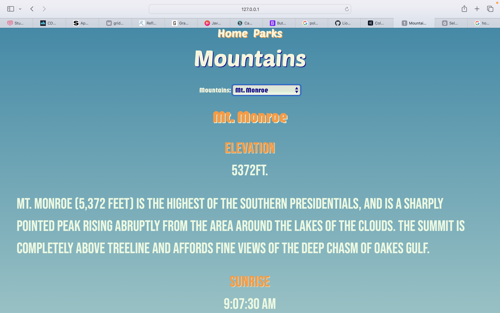
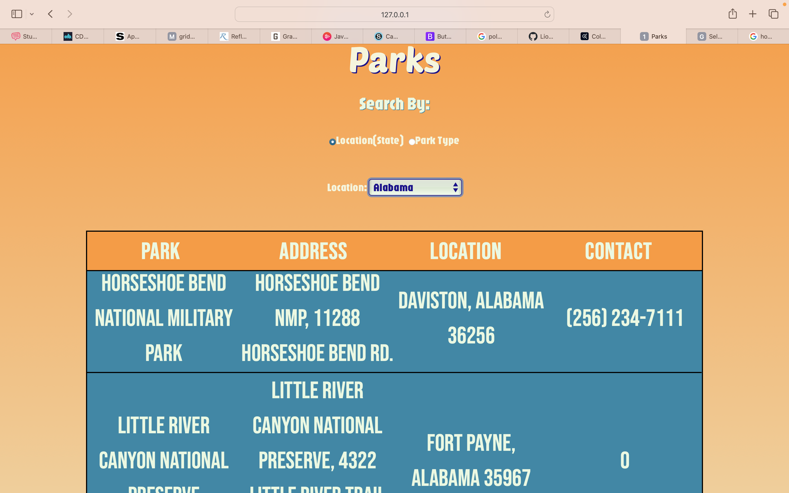
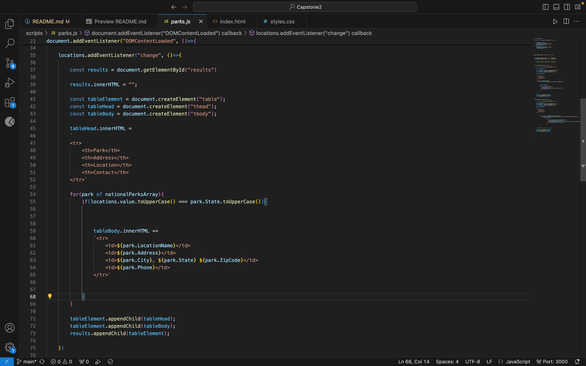

# CAPSTONE 2
I wanted to take another step with my coding skills when it came to the design of this website. My objective was to make a more complete/official looking website compared to my first Capstone project. I wanted a modern feel to my site and I wanted to use newer techniques to accomplish some of the ideas that I envisioned. For this website I used new things such as Keyframes, Grid (without bootstrap), and Javascript. 

## HOMEPAGE

I wanted my homepage to have a lot of moving parts this time as opposed to being static. I was inspired by the banner picture of the Yellowstone park to continue that gradient color throughout the page and the other pages as well. I wanted the homepage to feel like a trip through space, having a vast amount of colors but yet having balance and symmetry at the same time. Traveling through different parks that all have different landscapes felt like traveling through different worlds to me. 

## MOUNTAINS

I love the color gradient of this page, it feels like being at the summit of a mountain where the blue is up close and personal. My favorite part of this page was the use of Keyframes. I've barely used animations and keyframes before but I knew that I didnt want the information for the mountains to just jump on the page abruptly. The use of keyframes gave me the opportunity to add another CSS technique to my toolbelt and it was fun to play around with that and see what I can do with it.

## PARKS

This page allowed me the opportunity to really tap into my JavaScript skills. It posed a bit of a challenge to me but it showed me that I am capable of learning and utilizing JavaScript. I'm most proud of the table that I was able to insert into the page using only JS. I was having trouble getting the table to look like an actual table in the beginning. The headers werent lining up with the data, the text wasnt centering, among other issues. Once I was able to get it working exactly how I intended, I was overcome with relief and gratification. I didnt realize until after the fact, but the color choices seem to subconciously be a tribute to the Miami Dolphins.

